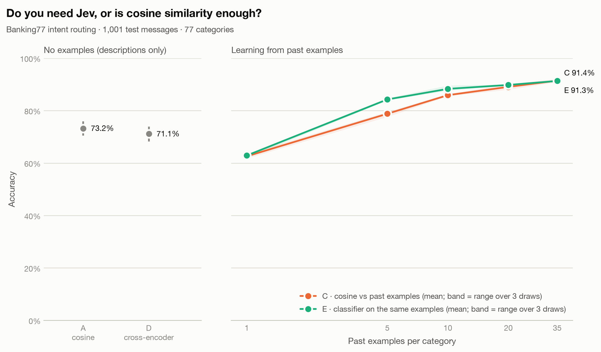

# Results: Jev vs cosine similarity on Banking77

_Jev (method B) has not been run yet; only the cosine methods are shown._

A classifier trained on the same past examples (method E) reaches **91.3%** with 35 per category.

A local cross-encoder that reads each message together with each description (method D) scores **71.1%**, -2.1 points vs cosine vs descriptions, at 804 ms per message on CPU.

| Method | Past examples per category | Accuracy (95% CI) | Median latency | p95 latency | Input tokens | List-price cost |
|---|---|---|---|---|---|---|
| A · cosine vs descriptions | 0 | 73.2% (70.4%–75.9%) | 7 ms | 9 ms | 0 | $0.0000 |
| D · cross-encoder vs descriptions | 0 | 71.1% (68.2%–73.9%) | 804 ms | 1122 ms | 0 | $0.0000 |
| C · cosine vs past examples (top-5 vote) | 1 | 62.6% (range 61.7%–63.5% over 3 draws) | 7 ms | 9 ms | 0 | $0.0000 |
| C · cosine vs past examples (top-5 vote) | 5 | 78.8% (range 77.6%–79.5% over 3 draws) | 7 ms | 9 ms | 0 | $0.0000 |
| C · cosine vs past examples (top-5 vote) | 10 | 85.9% (range 85.5%–86.3% over 3 draws) | 7 ms | 9 ms | 0 | $0.0000 |
| C · cosine vs past examples (top-5 vote) | 20 | 89.0% (range 88.0%–90.0% over 3 draws) | 7 ms | 9 ms | 0 | $0.0000 |
| C · cosine vs past examples (top-5 vote) | 35 | 91.4% (range 90.9%–92.1% over 3 draws) | 7 ms | 9 ms | 0 | $0.0000 |
| E · classifier trained on past examples | 1 | 62.9% (range 61.9%–63.3% over 3 draws) | 7 ms | 8 ms | 0 | $0.0000 |
| E · classifier trained on past examples | 5 | 84.2% (range 83.9%–84.7% over 3 draws) | 7 ms | 8 ms | 0 | $0.0000 |
| E · classifier trained on past examples | 10 | 88.3% (range 87.6%–89.6% over 3 draws) | 7 ms | 8 ms | 0 | $0.0000 |
| E · classifier trained on past examples | 20 | 89.8% (range 89.6%–90.0% over 3 draws) | 7 ms | 8 ms | 0 | $0.0000 |
| E · classifier trained on past examples | 35 | 91.3% (range 91.1%–91.6% over 3 draws) | 7 ms | 8 ms | 0 | $0.0000 |

## How to read this

- Every method answered the same 1,001 test messages from the Banking77 test split. The full sample is 13 per category x 77 categories = 1,001, shuffled; a smaller count means the first N of that sample.
- A embeds each category's name plus its one-line description. B (Jev) gets the same names and descriptions as Choice options, plus a one-sentence instruction. C compares against past customer messages from the training split (1, 5, 10, 20, 35 per category), drawn with 3 random seeds; 7 training rows that duplicated a test message (ignoring case and whitespace) were removed first.
- Prompt catalog: `banking77_intents.v1`. Embedding model: `BAAI/bge-small-en-v1.5@5c38ec7c405ec4b44b94cc5a9bb96e735b38267a`, run locally on CPU (free). Jev: not run.
- D scores (message, name + description) for every category with a cross-encoder reranker (`BAAI/bge-reranker-v2-m3@953dc6f6f85a1b2dbfca4c34a2796e7dde08d41e`), 77 pairs per message, locally on CPU, with no examples. Its latency is all 77 pairs for one message.
- E trains a logistic-regression classifier on the embeddings of the same past examples C votes with (same seeds, same messages). Training is offline and untimed.
- Latency for A and C is local embedding plus scoring per message. For Jev it is the full network round trip, including retry waits on routes with retries enabled.
- List-price cost is what the run would cost at $0.042 per million input tokens, even when the route used was free.
