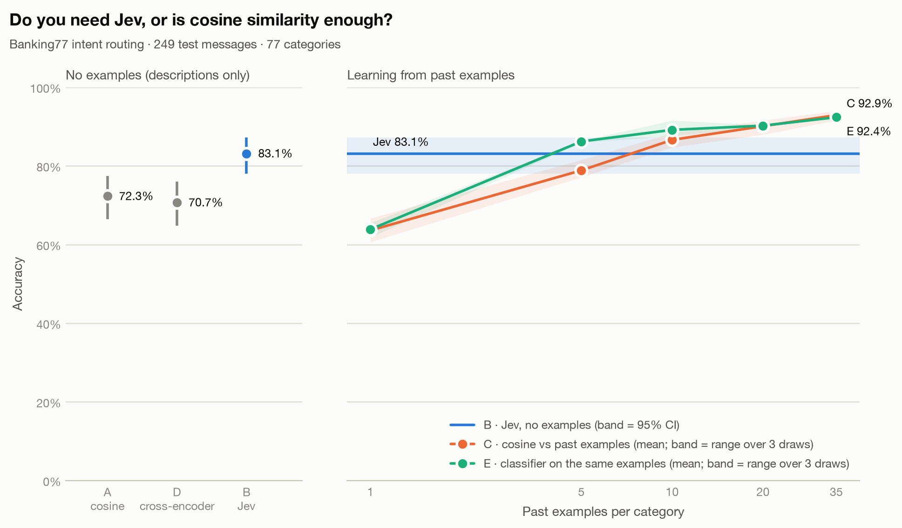

# Results: Jev vs cosine similarity on Banking77

**With no examples, Jev leads cosine by 10.8 points; the first tested setting where cosine vs past examples reaches Jev is 10 examples per category.**

A classifier trained on the same past examples (method E) reaches Jev at **5 examples per category**, and scores 92.4% with 35 per category.

A local cross-encoder that reads each message together with each description (method D) scores **70.7%**, -12.4 points vs Jev, at 813 ms per message on CPU.

| Method | Past examples per category | Accuracy (95% CI) | Median latency | p95 latency | Input tokens | List-price cost |
|---|---|---|---|---|---|---|
| A · cosine vs descriptions | 0 | 72.3% (66.4%–77.5%) | 7 ms | 11 ms | 0 | $0.0000 |
| B · Jev | 0 | 83.1% (78.0%–87.3%) | 770 ms | 906 ms | 591,682 | $0.0249 |
| D · cross-encoder vs descriptions | 0 | 70.7% (64.7%–76.0%) | 813 ms | 1219 ms | 0 | $0.0000 |
| C · cosine vs past examples (top-5 vote) | 1 | 63.6% (range 60.6%–66.7% over 3 draws) | 7 ms | 11 ms | 0 | $0.0000 |
| C · cosine vs past examples (top-5 vote) | 5 | 78.8% (range 77.1%–81.5% over 3 draws) | 7 ms | 11 ms | 0 | $0.0000 |
| C · cosine vs past examples (top-5 vote) | 10 | 86.6% (range 84.7%–88.4% over 3 draws) | 7 ms | 11 ms | 0 | $0.0000 |
| C · cosine vs past examples (top-5 vote) | 20 | 90.1% (range 88.0%–91.6% over 3 draws) | 7 ms | 11 ms | 0 | $0.0000 |
| C · cosine vs past examples (top-5 vote) | 35 | 92.9% (range 91.6%–94.0% over 3 draws) | 7 ms | 11 ms | 0 | $0.0000 |
| E · classifier trained on past examples | 1 | 63.9% (range 61.8%–65.5% over 3 draws) | 7 ms | 8 ms | 0 | $0.0000 |
| E · classifier trained on past examples | 5 | 86.2% (range 85.9%–86.3% over 3 draws) | 7 ms | 8 ms | 0 | $0.0000 |
| E · classifier trained on past examples | 10 | 89.2% (range 87.6%–91.6% over 3 draws) | 7 ms | 8 ms | 0 | $0.0000 |
| E · classifier trained on past examples | 20 | 90.2% (range 90.0%–90.4% over 3 draws) | 7 ms | 8 ms | 0 | $0.0000 |
| E · classifier trained on past examples | 35 | 92.4% (range 92.4%–92.4% over 3 draws) | 7 ms | 8 ms | 0 | $0.0000 |

## How to read this

- Every method answered the same 249 test messages from the Banking77 test split. The full sample is 13 per category x 77 categories = 1,001, shuffled; a smaller count means the first N of that sample.
- A embeds each category's name plus its one-line description. B (Jev) gets the same names and descriptions as Choice options, plus a one-sentence instruction. C compares against past customer messages from the training split (1, 5, 10, 20, 35 per category), drawn with 3 random seeds; 7 training rows that duplicated a test message (ignoring case and whitespace) were removed first.
- Prompt catalog: `banking77_intents.v1`. Embedding model: `BAAI/bge-small-en-v1.5@5c38ec7c405ec4b44b94cc5a9bb96e735b38267a`, run locally on CPU (free). Jev: `opencode.ai/jev-1.13-free` (model reported: jev-1.13-free).
- D scores (message, name + description) for every category with a cross-encoder reranker (`BAAI/bge-reranker-v2-m3@953dc6f6f85a1b2dbfca4c34a2796e7dde08d41e`), 77 pairs per message, locally on CPU, with no examples. Its latency is all 77 pairs for one message.
- E trains a logistic-regression classifier on the embeddings of the same past examples C votes with (same seeds, same messages). Training is offline and untimed.
- Latency for A and C is local embedding plus scoring per message. For Jev it is the full network round trip, including retry waits on routes with retries enabled.
- List-price cost is what the run would cost at $0.042 per million input tokens, even when the route used was free.
