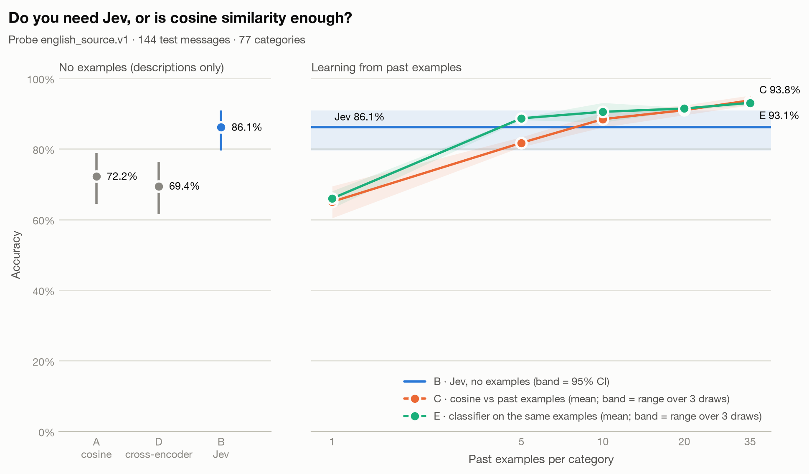

# Results: Jev vs cosine similarity on Banking77

**With no examples, Jev leads cosine by 13.9 points; the first tested setting where cosine vs past examples reaches Jev is 10 examples per category.**

A classifier trained on the same past examples (method E) reaches Jev at **5 examples per category**, and scores 93.1% with 35 per category.

A local cross-encoder that reads each message together with each description (method D) scores **69.4%**, -16.7 points vs Jev, at 833 ms per message on CPU.

| Method | Past examples per category | Accuracy (95% CI) | Median latency | p95 latency | Input tokens | List-price cost |
|---|---|---|---|---|---|---|
| A · cosine vs descriptions | 0 | 72.2% (64.4%–78.9%) | 6 ms | 8 ms | 0 | $0.0000 |
| B · Jev | 0 | 86.1% (79.5%–90.8%) | 769 ms | 900 ms | 342,304 | $0.0144 |
| D · cross-encoder vs descriptions | 0 | 69.4% (61.5%–76.4%) | 833 ms | 1285 ms | 0 | $0.0000 |
| C · cosine vs past examples (top-5 vote) | 1 | 65.0% (range 60.4%–69.4% over 3 draws) | 6 ms | 8 ms | 0 | $0.0000 |
| C · cosine vs past examples (top-5 vote) | 5 | 81.7% (range 80.6%–83.3% over 3 draws) | 6 ms | 8 ms | 0 | $0.0000 |
| C · cosine vs past examples (top-5 vote) | 10 | 88.4% (range 86.1%–90.3% over 3 draws) | 6 ms | 8 ms | 0 | $0.0000 |
| C · cosine vs past examples (top-5 vote) | 20 | 91.0% (range 89.6%–92.4% over 3 draws) | 6 ms | 8 ms | 0 | $0.0000 |
| C · cosine vs past examples (top-5 vote) | 35 | 93.8% (range 92.4%–95.1% over 3 draws) | 7 ms | 8 ms | 0 | $0.0000 |
| E · classifier trained on past examples | 1 | 66.0% (range 63.2%–68.1% over 3 draws) | 7 ms | 8 ms | 0 | $0.0000 |
| E · classifier trained on past examples | 5 | 88.7% (range 88.2%–88.9% over 3 draws) | 7 ms | 8 ms | 0 | $0.0000 |
| E · classifier trained on past examples | 10 | 90.5% (range 87.5%–93.1% over 3 draws) | 7 ms | 8 ms | 0 | $0.0000 |
| E · classifier trained on past examples | 20 | 91.4% (range 91.0%–91.7% over 3 draws) | 7 ms | 8 ms | 0 | $0.0000 |
| E · classifier trained on past examples | 35 | 93.1% (range 92.4%–93.8% over 3 draws) | 7 ms | 8 ms | 0 | $0.0000 |

## How to read this

- Every method answered the same 144 messages of probe `english_source.v1`; `probes/README.md` explains how they were built and checked.
- A embeds each category's name plus its one-line description. B (Jev) gets the same names and descriptions as Choice options, plus a one-sentence instruction. C compares against past customer messages from the training split (1, 5, 10, 20, 35 per category), drawn with 3 random seeds; 7 training rows that duplicated a test message (ignoring case and whitespace) were removed first.
- Prompt catalog: `banking77_intents.v1`. Embedding model: `BAAI/bge-small-en-v1.5@5c38ec7c405ec4b44b94cc5a9bb96e735b38267a`, run locally on CPU (free). Jev: `opencode.ai/jev-1.13-free` (model reported: jev-1.13-free).
- D scores (message, name + description) for every category with a cross-encoder reranker (`BAAI/bge-reranker-v2-m3@953dc6f6f85a1b2dbfca4c34a2796e7dde08d41e`), 77 pairs per message, locally on CPU, with no examples. Its latency is all 77 pairs for one message.
- E trains a logistic-regression classifier on the embeddings of the same past examples C votes with (same seeds, same messages). Training is offline and untimed.
- Latency for A and C is local embedding plus scoring per message. For Jev it is the full network round trip, including retry waits on routes with retries enabled.
- List-price cost is what the run would cost at $0.042 per million input tokens, even when the route used was free.
